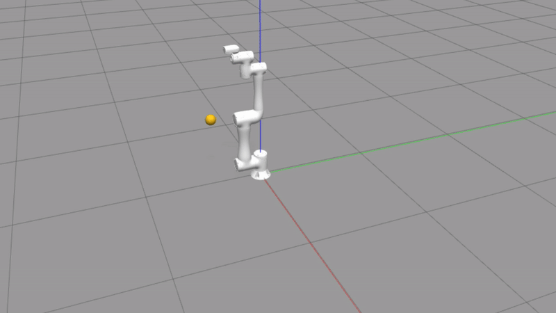
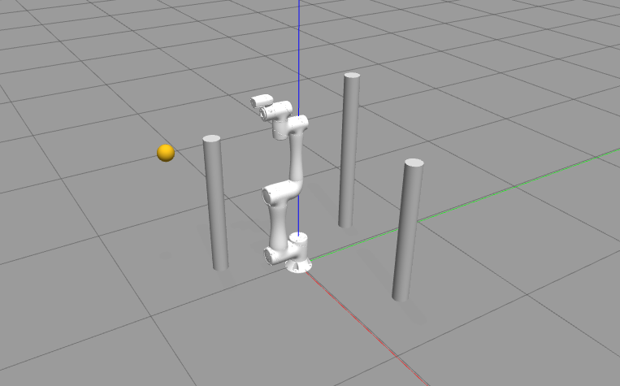

## Codici per Avvio Train e Test

Questo repository contiene gli script per l'addestramento (*train*) e il test (*test*) di un agente SAC per il controllo di un braccio robotico simulato con ROS 2 e Gazebo.

---

## 1. Preparazione dei Terminali

Prima di avviare il training o il test, eseguire le seguenti operazioni in due terminali distinti:

```bash
source /opt/ros/foxy/setup.bash
colcon build
install/setup.bash
```

---

## 2. Configurazione dei File per Aggiornamenti Dinamici

Alcuni file permettono di configurare:

* la **home position** del robot
* la **target position**
* i comandi di **pause** e **resume**

Questi file vanno configurati **una sola volta** seguendo le istruzioni al loro interno:

* `How_to_configure_robot_home.txt`
* `How_to_configure_robot_target.txt`
* `How_to_configure_robot_pause_resume.txt`

All'interno dei file sono presenti anche le istruzioni sull'utilizzo dei comandi.

---

## 3. Avvio Gazebo

Nel **primo terminale**, avviare la simulazione Gazebo:

* Senza ostacoli:

```bash
ros2 launch my_environment_pkg my_environment.launch.py
```

## Demo reach task tm5_900 (15k episodi di train RL)


* Con ostacoli:

```bash
ros2 launch my_environment_pkg my_environment_obs.launch.py
```

## Environment con ostacoli (versione beta)


---

## 4. Avvio Train / Test

Nel **secondo terminale**, eseguire:

* **Train**:

```bash
ros2 run my_environment_pkg run_environment
```

* **Test**:

```bash
ros2 run my_environment_pkg test_agent
```

Il file `test_agent` permette di testare il modello allenato in precedenza. La lunghezza del test (numero di episodi e step massimi) è modificabile.

### 4.1 Logging dei Risultati del Test

I risultati vengono salvati automaticamente in un file CSV: `Test_NUMEROTEST.csv`.

* Modificare `NUMEROTEST` per evitare sovrascritture.
* Ogni riga del CSV corrisponde a uno step dell'episodio e contiene le seguenti informazioni:

| Colonna                                     | Descrizione                                                  |
| ------------------------------------------- | ------------------------------------------------------------ |
| Epoche_modello                              | Numero di episodi sui quali il modello è stato allenato      |
| Num_episodio_attuale                        | Numero dell'episodio corrente                                |
| Num_episodi_da_fare                         | Numero totale di episodi da completare nel test              |
| Dist_EE_target_iniziale                     | Distanza iniziale tra end-effector e target                  |
| Dist_EE_target_attuale                      | Distanza attuale tra end-effector e target                   |
| X_target, Y_target, Z_target                | Coordinate del target nello spazio                           |
| Numero_step                                 | Step corrente dell'episodio                                  |
| Ricompensa_episodio_attuale                 | Ricompensa cumulativa dell'episodio corrente                 |
| Conteggio_successi_globale                  | Numero di successi accumulati fino a questo episodio         |
| Tasso_successo_globale                      | Percentuale di successi fino a questo punto                  |
| Angolo_primo_giunto ... Angolo_sesto_giunto | Angoli dei 6 giunti del robot                                |
| Stato_home_position                         | Booleano, True se il robot è in home position                |
| Target_raggiunto                            | Booleano, True se il target è stato raggiunto in questo step |

---

## 5. Gestione dei Pesi e dei Log

* Nei file `train_agent.py` e `test_agent.py` è necessario inserire il path dei pesi da utilizzare.
* I pesi vengono salvati nella cartella `checkpoints/train_NUMEROTRAIN`, insieme a:

  * `Monitoraggio.csv`: storico dell'apprendimento
  * `Test_NUMEROTEST.csv`: log dei test generati da `test_agent`

---

## 6. Plottaggio Grafici

Per visualizzare l'evoluzione dell'apprendimento:

* Aprire `my_environment_pkg/plot_train.py`
* Modificare il path di `Monitoraggio.csv` da plottare
* Eseguire lo script per generare i grafici.
